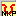

<head>
<title>Keyman/kmfl Keyboard for Nkonya Phonetic Annotations</title>
<meta name="author" content="Wes Peacock">
</head>

# Keyboard: Ghana Unicode &ndash; Nkonya Phonetic variant

##Introduction
This keyboard is designed for the purpose of keying phonetic annotations in the dictionary of the Nkonya language of Ghana. The keystrokes of the Nkonya Phonetic keyboard produce the IPA (International Phonetic Alphabet) characters equivalent to Nkonya letters, and has additional IPA features.

##Keystrokes Used
 Two of the letters in the Nkonya alphabet (ɩ and ʋ) are different in the IPA (ɪ and ʊ). As well, the IPA characters don't have upper case. Some upper case keystrokes are used to type IPA characters that are not in the Nkonya alphabet.

Unlike with the regular Nkonya keyboard, tone marks are typed after the letter. Here are the Nkonya special keys and the IPA characters that are produced:

<table width="80%">
	<tr>
		<td align="center" bgcolor="#E9E9E9"> \[ → ɛ  </td>
		<td align="center">  x →  ɪ  </td>
		<td align="center" bgcolor="#E9E9E9"> = → ŋ  </td>
		<td align="center">  \] → ɔ  </td>
		<td align="center" bgcolor="#E9E9E9"> q → ʊ  </td>
	</tr>
	<tr>
		<td align="center" bgcolor="#E9E9E9"> a' → a&#x0301; </td>
		<td align="center"> e' → e&#x0301;  </td>
		<td align="center" bgcolor="#E9E9E9"> \[' → ɛ&#x0301;  </td>
		<td align="center"> i' → i&#x0301;   </td>
		<td align="center" bgcolor="#E9E9E9">x' → ɪ&#x0301; </td>
	</tr>
	<tr>
		<td align="center" bgcolor="#E9E9E9"> o' → o&#x0301; </td>
		<td align="center">  \]' → ɔ&#x0301; </td>
		<td align="center" bgcolor="#E9E9E9">  u' →  u&#x0301; </td>
		<td align="center">  q' → ʊ&#x0301;  </td>
	</tr>
</table>
  

There are some sounds in Nkonya where the Nkonya alphabet uses two letters that are marked in IPA with a single letter:
<table width="75%">
	<tr>
		<td align="center" bgcolor="#E9E9E9"> ny = &#x0272; </td>
		<td align="center"> Keystroke: N  </td>
		<td align="center" bgcolor="#E9E9E9"> E.g.: nya "to get" – &#x0272;a is typed Na  </td>
	</tr>
	<tr>
		<td align="center" bgcolor="#E9E9E9"> gy = &#x02A4; </td>
		<td align="center"> Keystroke: J  </td>
		<td align="center" bgcolor="#E9E9E9"> E.g.: gya "to get" – &#x02A4;a is typed Ja  </td>
	</tr>
</table>
  

Nkonya has a glottal stop that isn't marked in the alphabet:
<table width="75%">
	<tr>
		<td align="center" bgcolor="#E9E9E9">&#x0294;</td>
		<td align="center"> Keystroke: ?  </td>
		<td align="center" bgcolor="#E9E9E9"> E.g.: dɔ "to farm” – dɔ&#x0294; is typed d\]?  </td>
	</tr>
</table>
  

A nasalized vowel is marked in the Nkonya alphabet with n after it. In IPA it is marked with a tilde ( ~ ) over the vowel ( &#x25CC;&#x0303; ):

<table width="80%">
	<tr>
		<td align="center" bgcolor="#E9E9E9">&#x25CC;&#x0303;</td>
		<td align="center"> Keystroke: ~</td>
		<td align="center" bgcolor="#E9E9E9"> E.g.:  dan “to be mature” – da&#x0303;&#x0294; is typed da~?</td>
	</tr>
</table>
  

In addition to the high tone (&#x25CC;&#x0301;) mentioned above, there are rising ( &#x25CC;&#x030C; ) and falling ( &#x25CC;&#x0302; ) tones in Nkonya that aren't marked in the alphabet:

<table width="80%">
	<tr>
		<td align="center" bgcolor="#E9E9E9">&#x25CC;&#x030C;</td>
		<td align="center"> Keystroke: \$</td>
		<td align="center" bgcolor="#E9E9E9"> E.g.:  baflɛ "pawpaw" – baflɛ&#x030C;&#x0294; is typed bafl\[$?</td>
	</tr>
	<tr>
		<td align="center" bgcolor="#E9E9E9">&#x25CC;&#x0302;</td>
		<td align="center"> Keystroke: ^</td>
		<td align="center" bgcolor="#E9E9E9"> E.g.:  ɩdɛhɔ "It is burning" – ɪdɛhɔ&#x0302;&#x0294; is typed xd\[h\]^?</td>
	</tr>
</table>
  

Tones can be stacked on top of a nasalized vowel as well. Type the tilde ( ~ ) first:

<table width="90%">
	<tr>
		<td align="center" bgcolor="#E9E9E9">&#x25CC;&#x0303;&#x0302;</td>
		<td align="center"> Keystroke: ~^</td>
		<td align="center" bgcolor="#E9E9E9"> E.g.:  ɔdɛdan "He is maturing" – ɔdɛda&#x0303;&#770;&#x0294; is typed \]d\[da~^?</td>
	</tr>
</table>
  

A long vowel is marked in the Nkonya alphabet with a double vowel. In IPA it is marked with a special colon after it. The colon is two triangles ( &#720; ) instead of two dots:

<table width="75%">
	<tr>
		<td align="center" bgcolor="#E9E9E9">&#720;</td>
		<td align="center"> Keystroke &ndash; :</td>
		<td align="center" bgcolor="#E9E9E9"> E.g.:  fɛ́ɛ́ "all" – fɛ́ː is typed f\[':</td>
	</tr>
</table>
  

When two letters are joined together to form a single sound (E.g. kp and gb in Nkonya), the IPA uses a tie bar (  k&#x0361;p  ) over the two letters. An n in front of kp has both ŋ and m sounds and should use both ŋ and m with a tie bar in IPA ŋ&#x0361;m. For example, nkpa "life" – ŋ&#x0361;mk&#x0361;pa
:

<table width="75%">
	<tr>
		<td align="center" bgcolor="#E9E9E9">&#x25CC;&#x0361;&#x25CC;</td>
		<td align="center"> Keystroke: %</td>
		<td align="center" bgcolor="#E9E9E9"> E.g.:  ɔkpa "path" – ɔk&#x0361;pa  is typed ]k%pa</td>
	</tr>
	<tr>
		<td align="center" bgcolor="#E9E9E9">ŋ&#x0361;m</td>
		<td align="center"> Keystroke: n%m</td>
		<td align="center" bgcolor="#E9E9E9"> E.g.: nkpa "life" – ŋ&#x0361;mk&#x0361;pa is typed =%mk%pa </td>
	</tr>
</table>
  

An n in front of an f is different from both m and n. IPA uses a different letter, &#x0271;.

<table width="75%">
	<tr>
		<td align="center" bgcolor="#E9E9E9">&#x0271;</td>
		<td align="center"> Keystroke: M</td>
		<td align="center" bgcolor="#E9E9E9"> E.g.: anfɩ "this" – a&#x0271;fɪ is typed aMfx </td>
	</tr>
</table>
  

t&#x0361;&#x0283; is used for the English “ch” sound. In Nkonya, this sound varies according to dialect. The Southern dialect "ts" should also have a tie bar:

<table width="75%">
	<tr>
		<td align="center" bgcolor="#E9E9E9">t&#x0361;&#x0283;</td>
		<td align="center"> Keystroke: t%S </td>
		<td align="center" bgcolor="#E9E9E9"> E.g.:  ntsu "water" (Northern) – nt&#x0361;&#x0283;u is typed nt%Su 
		E.g.:  kɩaɩ "dog" (Southern) – t&#x0361;&#x0283;ɪaɪ is typed t%Sxax
		</td>
	</tr>
	<tr>
		<td align="center" bgcolor="#E9E9E9">t&#x0361;s</td>
		<td align="center"> Keystroke: t%s </td>
		<td align="center" bgcolor="#E9E9E9"> E.g.:  ntsu "water" (Southern) – nt&#x0361;su is typed nt%su 
		Northern dialect pronounces "ts" as t&#x0361;&#x0283;
		</td>
	</tr>
</table>
  

A w following a consonant uses a special raised w – b&#x02B7; to indicate that it modifies the consonant:

<table width="75%">
	<tr>
		<td align="center" bgcolor="#E9E9E9">&#x02B7;</td>
		<td align="center"> Keystroke: W</td>
		<td align="center" bgcolor="#E9E9E9"> E.g.:  bwɛ "make" – b&#x02B7;ɛ&#x0294; is typed bW\[?</td>
	</tr>
</table>
  

##The Icon
The icon for the keyboard is: 
