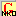

<head>
<title>Keyman/kmfl Keyboard for Nkonya (NKO)</title>
<meta name="author" content="Wes Peacock">
</head>

# Keyboard: Ghana Unicode &ndash; Nkonya variant

##Introduction
This keyboard is used for typing the alphabet of the Nkonya language of Ghana. It is the same as the Ghana Short keyboard with two extra vowels and a high tone diacritic marker.

##Keystrokes Used
The following keys are modified by the Nkonya keyboard:

<table width="80%">
	<tr>
		<td align="center" bgcolor="#E9E9E9"> \[ → ɛ  </td>
		<td align="center">  \{ → Ɛ  </td>
		<td align="center" bgcolor="#E9E9E9">  \] → ɔ  </td>
		<td align="center">  \} → Ɔ  </td>
		<td align="center" bgcolor="#E9E9E9"> = → ŋ  </td>
		<td align="center">  \+ → Ŋ  </td>
	</tr>
	<tr>
		<td align="center" bgcolor="#E9E9E9"> x → ɩ </td>
		<td align="center">  X → Ɩ </td>
		<td align="center" bgcolor="#E9E9E9"> q → ʋ </td>
		<td align="center">  Q → Ʋ  </td>
	</tr>
	<tr>
		<td align="center" bgcolor="#E9E9E9"> 'a → a&#769; </td>
		<td align="center">  'A → A&#769; </td>
		<td align="center" bgcolor="#E9E9E9">  'e →  e&#769; </td>
		<td align="center">  'E → E&#769;  </td>
		<td align="center" bgcolor="#E9E9E9"> '\[ →  ɛ&#769; </td>
		<td align="center">  '{ →  Ɛ&#769; </td>
	</tr>
	<tr>
		<td align="center" bgcolor="#E9E9E9"> 'i → i&#769; </td>
		<td align="center">  'I → I&#769; </td>
		<td align="center" bgcolor="#E9E9E9">  'x →  ɩ&#769; </td>
		<td align="center">  'X → Ɩ&#769;  </td>
		<td align="center" bgcolor="#E9E9E9"> 'o →  o&#769; </td>
		<td align="center">  'O →  O&#769; </td>
	</tr>
	<tr>
		<td align="center" bgcolor="#E9E9E9"> '] → ɔ&#769; </td>
		<td align="center">  '} → Ɔ&#769; </td>
		<td align="center" bgcolor="#E9E9E9">  'u →  u&#769; </td>
		<td align="center">  'U → U&#769;  </td>
		<td align="center" bgcolor="#E9E9E9"> 'q →  ʋ&#769; </td>
		<td align="center">  'Q →  Ʋ&#769; </td>
	</tr>
</table>
  

; (semicolon key) followed by any of the above letters gives the English character:

 <table width="80%">
    <tr>
       <td align="center" bgcolor="#E9E9E9"> \;\[ → \[   </td>
        <td align="center"> \;\{ → \{ </td>
        <td align="center" bgcolor="#E9E9E9"> \;\] → \]   </td>
        <td align="center"> \;\} → \}  </td>
        <td align="center" bgcolor="#E9E9E9"> \;= → =</td>
        <td align="center"> \;+ → +  </td>
     </tr>
	<tr>
		<td align="center" bgcolor="#E9E9E9"> ;x → x  </td>
		<td align="center">  ;X → X  </td>
		<td align="center" bgcolor="#E9E9E9"> ;q → q  </td>
		<td align="center">  ;Q → Q  </td>
	</tr>
</table>
  

##The Keyboard Icon
The icon for the keyboard is: 
