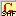

<head>
<meta name="author" content="Wes Peacock">
</head>

# Keyboard: Ghana Unicode &ndash; Safaliba variant

##Introduction
This keyboard is used for typing the alphabet of the Safaliba language of Ghana. It is the same as the Ghana Short keyboard with two additional vowels and high tone, low tone and nasalization markers.

##Keystrokes Used
The following keys are modified by this keyboard:

<table width="80%">
	<tr>
		<td align="center" bgcolor="#E9E9E9"> [ → ɛ  </td>
		<td align="center">  { → Ɛ  </td>
		<td align="center" bgcolor="#E9E9E9">  ] → ɔ  </td>
		<td align="center">  } → Ɔ  </td>
		<td align="center" bgcolor="#E9E9E9"> = → ŋ  </td>
		<td align="center">  + → Ŋ  </td>
	</tr>
	<tr>
		<td align="center" bgcolor="#E9E9E9"> x → e&#817; </td>
		<td align="center">  X → E&#817; </td>
		<td align="center" bgcolor="#E9E9E9"> q → o&#817; </td>
		<td align="center">  Q → O&#817;  </td>
	</tr>
</table>
  

The Safaliba keyboard uses apostrophe ( ' ), grave accent ( ` ), and tilde ( ~ ) for the corresponding combining diacritics, &#9676;&#769;, &#9676;&#768; and  &#9676;&#771;. They can be stacked. Type them following the character they will modify:

 <table width="90%">
	<tr>
		<td align="center" bgcolor="#E9E9E9"> ' → &#9676;&#769;  </td>
		<td align="center">  ` → &#9676;&#768;  </td>
		<td align="center" bgcolor="#E9E9E9"> ~ →  &#9676;&#771; </td>
		<td align="center" > E.g.: a'  → a&#769; </td>
		<td align="center"  bgcolor="#E9E9E9">x`  → e&#817;&#768; </td>
		<td align="center" > ]~   →  ɔ&#771;</td>
		<td align="center"  bgcolor="#E9E9E9">q~`  → o&#817;&#771;&#768; </td>
	</tr>
</table>
  

; (semicolon key) followed by any of the above keystrokes gives the original character:

 <table width="80%">
    <tr>
       <td align="center" bgcolor="#E9E9E9"> ;[ → [   </td>
        <td align="center"> ;{ → { </td>
        <td align="center" bgcolor="#E9E9E9"> ;] → ]   </td>
        <td align="center"> ;} → }  </td>
        <td align="center" bgcolor="#E9E9E9"> ;= → =</td>
        <td align="center"> ;+ → +  </td>
     </tr>
	<tr>
		<td align="center" bgcolor="#E9E9E9"> ;x → x  </td>
		<td align="center">  ;X → X  </td>
		<td align="center" bgcolor="#E9E9E9"> ;q → q  </td>
		<td align="center">  ;Q → Q  </td>
	</tr>
	<tr>
		<td align="center" bgcolor="#E9E9E9"> ;' → '  </td>
		<td align="center">  ;` → `  </td>
		<td align="center" bgcolor="#E9E9E9"> ;~ → ~  </td>
	</tr>
</table>
  
      
##The Keyboard Icon
The icon for the keyboard is: 
