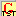

<head>
<title>Test Keyman/kmfl Keyboard</title>
<meta name="author" content="Wes Peacock">
</head>

# Keyboard: Ghana Unicode &ndash; Test

##Introduction
This keyboard is used for testing the Ghana Keyman/kmfl keyboards. This document provides a template for new keyboards.

##Keystrokes Used
This section has tables showing the key stroke for the keyboard and what it produces.
The process for producing PDFs doesn't give table borders, so the tables use a light grey background for every other cell.

The following keys are modified by the XXX keyboard:

<table width="80%">
	<tr>
		<td align="center" bgcolor="#E9E9E9"> \[ → ɛ  </td>
		<td align="center">  \{ → Ɛ  </td>
		<td align="center" bgcolor="#E9E9E9">  \] → ɔ  </td>
		<td align="center">  \} → Ɔ  </td>
		<td align="center" bgcolor="#E9E9E9"> = → ŋ  </td>
		<td align="center">  \+ → Ŋ  </td>
	</tr>
</table>
  

; (semicolon key) followed by any of the above keystrokes gives the original character:

 <table width="80%">
    <tr>
       <td align="center" bgcolor="#E9E9E9"> \;\[ → \[   </td>
        <td align="center"> \;\{ → \{ </td>
        <td align="center" bgcolor="#E9E9E9"> \;\] → \]   </td>
        <td align="center"> \;\} → \}  </td>
        <td align="center" bgcolor="#E9E9E9"> \;= → =</td>
        <td align="center"> \;+ → +  </td>
     </tr>
	<tr>
		<td align="center" bgcolor="#E9E9E9"> ;x → x  </td>
		<td align="center">  ;X → X  </td>
		<td align="center" bgcolor="#E9E9E9"> ;q → q  </td>
		<td align="center">  ;Q → Q  </td>
		<td align="center" bgcolor="#E9E9E9"> ;' → '  </td>
	</tr>
</table>
  

More detail for a keystroke can be given in a table with the following form (taken from the Nkonya Phonetic keyboard):

<table width="80%">
	<tr>
		<td align="center" bgcolor="#E9E9E9">&#x25CC;&#x030C;</td>
		<td align="center"> Keystroke: \$</td>
		<td align="center" bgcolor="#E9E9E9"> E.g.:  baflɛ "pawpaw" – baflɛ&#x030C;&#x0294; is typed bafl\[$?</td>
	</tr>
	<tr>
		<td align="center" bgcolor="#E9E9E9">&#x25CC;&#x0302;</td>
		<td align="center"> Keystroke: ^</td>
		<td align="center" bgcolor="#E9E9E9"> E.g.:  ɩdɛhɔ "It is burning" – ɪdɛhɔ&#x0302;&#x0294; is typed xd\[h\]^?</td>
	</tr>
</table>
  

##The Keyboard Icon
The icon for the keyboard is: 
